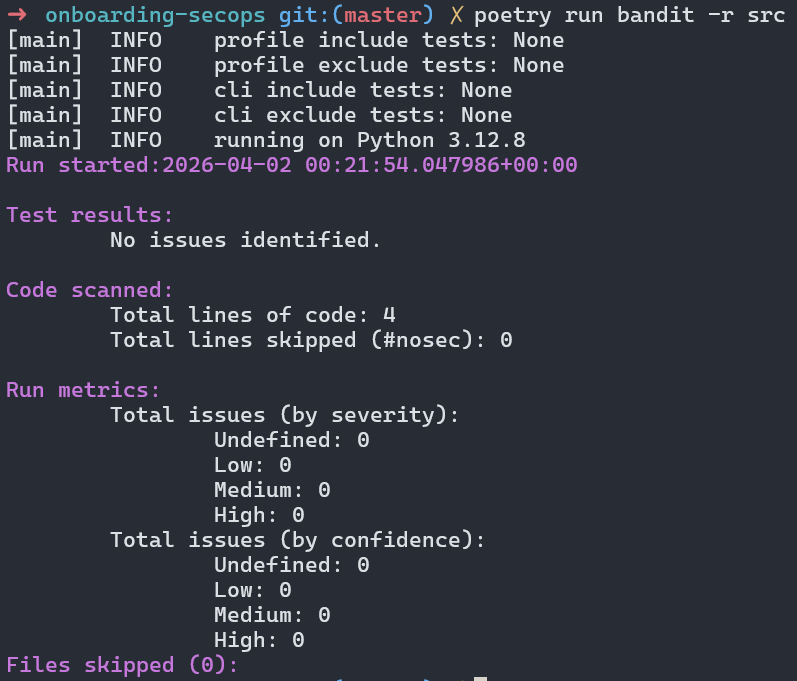
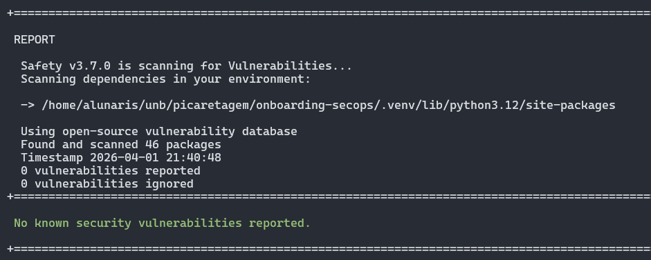
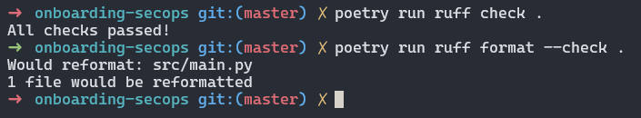

# Relatório de Prontidão Técnica: Onboarding SecOps
**Disciplina:** Engenharia de Produto de Software (FGA0316) - 2026.1

**Aluno:** Leandro de Almeida Oliveira | **Matrícula:** [21/1030827]

## 1. Configuração do Ambiente (Zero Trust & Isolamento)
Conforme as diretrizes de Soberania Técnica, as seguintes configurações foram aplicadas:
- [X] **Python 3.12:** Instalado e verificado.
- [X] **Poetry:** Configurado para criar `.venv` dentro do projeto (`virtualenvs.in-project true`).
- [X] **Determinismo:** Arquivos `pyproject.toml` e `poetry.lock` gerados com sucesso.

## 2. Logs de Auditoria e Qualidade (Security Gate)
Abaixo constam os resumos das execuções dos comandos de segurança:

### 2.1. Auditoria Estática (Bandit)

*Comando: `poetry run bandit -r .`*

**Observação:** o comando `poetry run bandit -r .` também analisava a pasta `.venv`, gerando achados referentes a dependências de terceiros e não ao código do projeto. Assim, para auditar apenas o código autoral, foi utilizado `poetry run bandit -r src`.

### 2.2. Verificação de Dependências (Safety)

*Comando: `poetry run safety check`*

### 2.3. Qualidade e Conformidade (Ruff)

*Comando: `poetry run ruff check .`*

## 3. Evidência de Integração Contínua (CI)
O pipeline automatizado foi executado com sucesso no GitHub Actions:
- **Link da Action de Sucesso:** [COLE AQUI O LINK DO SEU GITHUB ACTIONS]

## 4. Declaração de Soberania Técnica (CISSP Domain 8)
Eu, Leandro de Almeida Oliveira, declaro que auditei manualmente as ferramentas e dependências deste projeto. Confirmo que o código gerado via IA (GitHub Copilot) passou pela minha revisão humana (*Human-in-the-loop*), garantindo que não há vazamento de segredos ou falhas lógicas críticas antes da migração para o ecossistema da PCDF.

---
**Data de Entrega:** [01/04/2026]